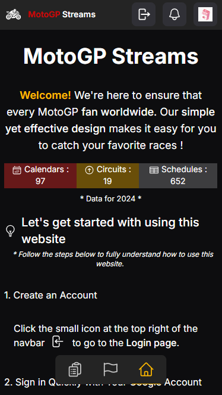
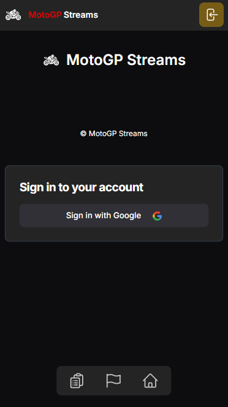
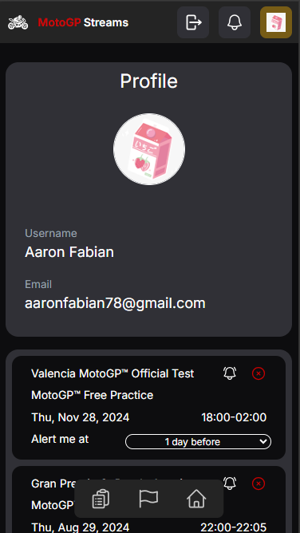
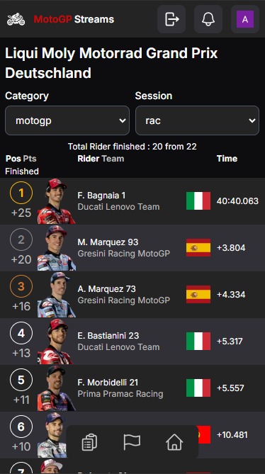
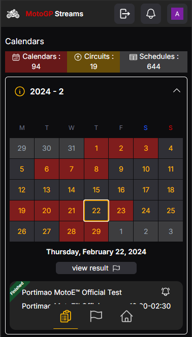

# MotoGP Streams

Get real-time notifications for your favorite MotoGP events directly through the Line Messenger app. Never miss a race again with our seamless integration—simply register, and we’ll keep you updated with all the action. Enjoy a personalized MotoGP experience with instant alerts and reminders!

## Techologies

- HTML
- CSS
- JavaScript
- TypeScript
- Next.JS
- MySQL
- Hero Icons
- React Hot Toast
- Tailwind.css
- Socket IO

## Link Website

https://motogp-streams.xyz

## Screenshot

| Main Page                                         |
| ------------------------------------------------- |
|  |

| Signin Page                                         |
| -------------------------------------------------- |
|  |

| Account Page                                         |
| ----------------------------------------------------- |
|  |

| Results Page                                     |
| -------------------------------------------------- |
|  |

| Schedules Page                           |
| ---------------------------------------------------------- |
|  |

## Installation

Clone and move to the repository

# important

don't forget to setup your mysql and .env

```bash
git clone https://github.com/AaronFabian/motogp-streams.git;
cd motogp-streams;
```

# install packages

```bash
npm i;
```

# run the server

```bash
npm run dev;
```
